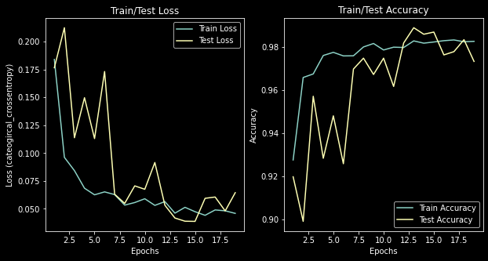

# Mask-Emotion Detection

**AI powered system for detecting whether a person is wearing a mask and if not, their facial expression** 

## Contributers
- Samuel Mohebban (B.A. Psychology - George Washington University)
    - Samuel.MohebbanJob@gmail.com
    - [LinkedIn](https://www.linkedin.com/in/samuel-mohebban-b50732139/)
    - [Medium](https://medium.com/@HeeebsInc)

## Business Problem
- In the age of COVID-19, mask protection has been a vital instrument for stopping spread of the virus.  However, there has been much debate over whether people should be forced to wear one.  
- Many businesses require that all customers wear a face mask, and have been found to enforce these rules by not allowing people to enter if they are found not wearing a face covering.
- Even though these rules are clear, many people around the United States have refused to follow these rules, and have causes disruptions at local business for being told they cannot enter without a mask

## Solution
- This project is meant to fix this issue by detecting whether a person is wearing a mask, and if they are not, their facial expression will be read to determine if they are disgruntled. 
- This detection will use a Convolutional Neural Network to read each frame of a video and make these detections

## Requirements
- `keras` (PlaidML backend --> GPU: RX 580 8GB)
- `numpy`
- `opencv`
- `matplotlib`

## Data
- Two datasets were used to train two neural networks
1. Face Mask: ~12K Images Dataset ([Kaggle](https://www.kaggle.com/ashishjangra27/face-mask-12k-images-dataset?select=Face+Mask+Dataset))
2. Emotion: ~30K Images Dataset ([Kaggle](https://www.kaggle.com/msambare/fer2013))

## Modeling

**1. Face Mask Detection: Mobilenet**
- [Notebook](MobilenetMasks.ipynb)
- Images were resized to (224, 224)
- Weights for imagenet were applied as well as sigmoid activation for the output layer, and binary crossentropy for the loss function
- Mobilenet was trained on the mask dataset
- Augmentation was applied to the training to ensure the model is able to generalize predictions to unknown data 

     

**2. Emotion Detection: Convolutional Neural Network** 
- [Notebook](NormalEmotions.ipynb)
- Images were resized to (48,48)
- Softmax activation and categorical crossentropy were applied

## LIME Feature Extraction
- [Notebook](LimeFE.ipynb)

## Deployment
- [Notebook](FaceDetector.ipynb)

## Future Directions