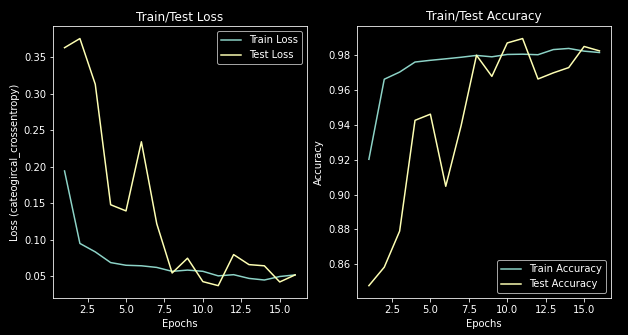
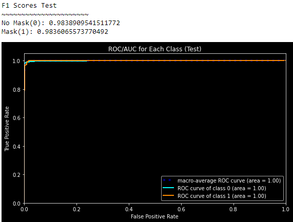
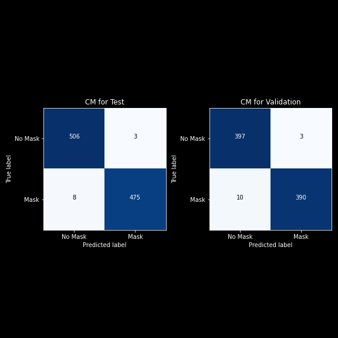
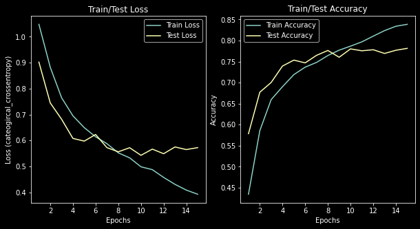
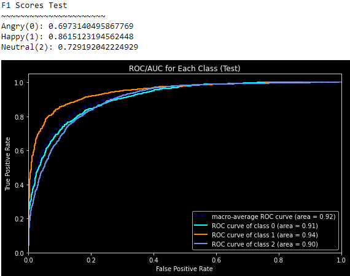
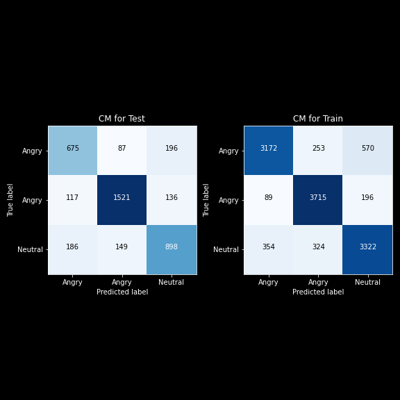

# Mask-Emotion Detection

**AI powered system for detecting whether a person is wearing a mask and if not, their facial expression** 

## Contributers
- Samuel Mohebban (B.A. Psychology - George Washington University)
    - Samuel.MohebbanJob@gmail.com
    - [LinkedIn](https://www.linkedin.com/in/samuel-mohebban-b50732139/)
    - [Medium](https://medium.com/@HeeebsInc)

- I outline how to do this in my [Blog](https://towardsdatascience.com/custom-object-detection-using-keras-and-opencv-ddfe89bb3c3?source=friends_link&sk=a4b802501d1cf4423bead44b94e7657a)

## Business Problem
- In the age of COVID-19, mask protection has been a vital instrument for stopping spread of the virus.  However, there has been much debate over whether people should be forced to wear one.  
- Many businesses require that all customers wear a face mask, and have been found to enforce these rules by not allowing people to enter if they are found not wearing a face covering.
- Even though these rules are clear, many people around the United States have refused to follow these rules, and have causes disruptions at local business for being told they cannot enter without a mask

## Solution
- This project is meant to fix this issue by detecting whether a person is wearing a mask, and if they are not, their facial expression will be read to determine if they are disgruntled. 
- This detection will use a Convolutional Neural Network to read each frame of a video and make these detections

## Requirements
- `keras` (PlaidML backend --> GPU: RX 580 8GB)
- `numpy`
- `opencv`
- `matplotlib`

## Data
- Two datasets were used to train two neural networks
#### 1. **Face Mask**: ~12K Images Dataset ([Kaggle](https://www.kaggle.com/ashishjangra27/face-mask-12k-images-dataset?select=Face+Mask+Dataset))

     

#### 2. **Emotion**: ~30K Images Dataset ([Kaggle](https://www.kaggle.com/msambare/fer2013))

     

## Pre-processing 
**1. Face Mask Detection: Mobilenet**

     

**1. Face Mask Detection: Mobilenet**

     

## Modeling
- For each model, early stopping was applied to prevent the model from overfitting
- The data for the models can be retrieved using the functions within the [Functions.py](PyFunctions/Functions.py) file
- Visualizations functions for the confusion matrix, loss/accuracy, and ROC curve can be found within the [Viz.py](PyFunctions/Viz.py) file 

**1. Face Mask Detection: Mobilenet**
- [Notebook](MobilenetMasks.ipynb)
- Images were resized to (224, 224)
- Weights for imagenet were applied as well as sigmoid activation for the output layer, and binary crossentropy for the loss function
- Mobilenet was trained on the mask dataset
- Augmentation was applied to the training to ensure the model is able to generalize predictions to unknown data 
- Predicted Classes: No Mask(0) & Mask(1)

     
     

     

**2. Emotion Detection: Convolutional Neural Network** 
- [Notebook](NormalEmotions.ipynb)
- Images were resized to (48,48)
- Softmax activation and categorical crossentropy were applied
- Predicted Classes: Angry(0), Happy(1), Neutral(2)

     
     

     

## Deployment
- [Notebook](FaceDetector.ipynb)
- In this section, the models were applied to live video
- The steps for applying this to live video were as follows:\
    1. Use [Haar feature based cascade classifier](https://opencv-python-tutroals.readthedocs.io/en/latest/py_tutorials/py_objdetect/py_face_detection/py_face_detection.html) to locate the coordinates of a face within a frame
    2. Extract the ROI of the face using the coordinates given by the classifier
    3. Make two copies of the ROI, one for the mask model and another for the emotion model
    4. Resize each copy to the correspoding dimensions used within the models 
    5. Start by making a mask prediction
        - If the model detects there is a mask, it will stop predicting and show a green box
        - If the model does not detect the mask, the algorithm will move onto the emotion model

     

      
- Below you can see a .gif of how it works on my local machine
    

## Future Directions

- Use more models (InceptionNet, VGG16, etc.)
- Use a camera that detects heat.  This can be used to determine if someone is experiencing fever.
- More data.  So far, this model has trouble detecting a mask when a person is wearing glasses.  Using more images with people that wear glasses will get better results
